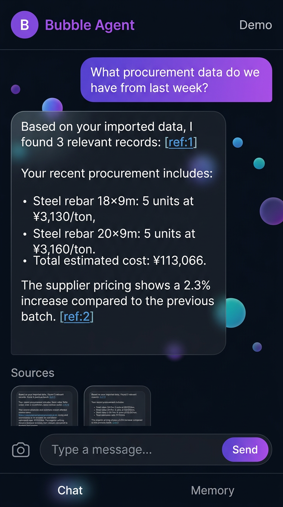
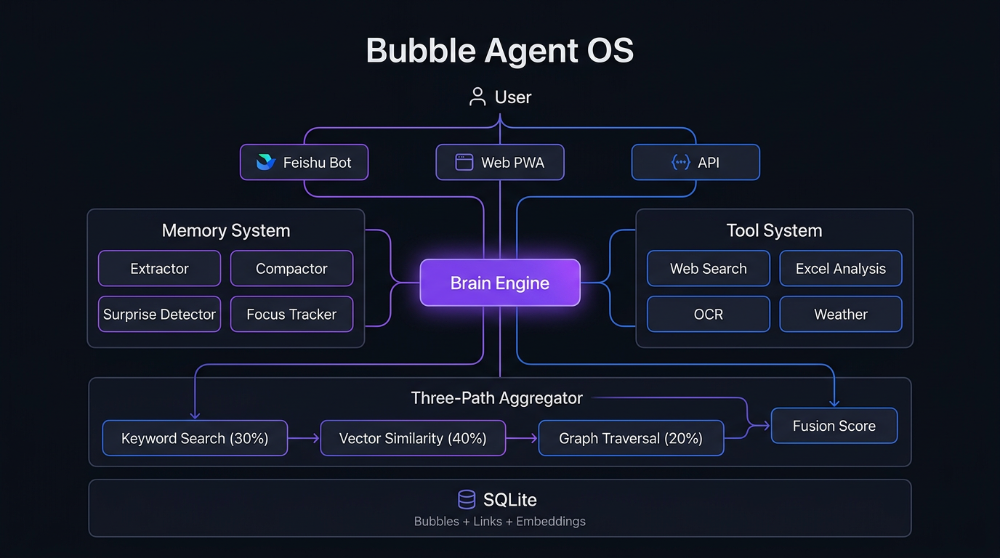
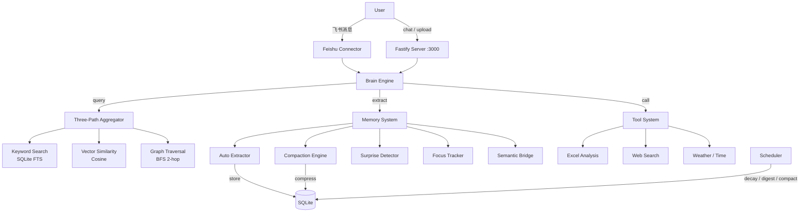
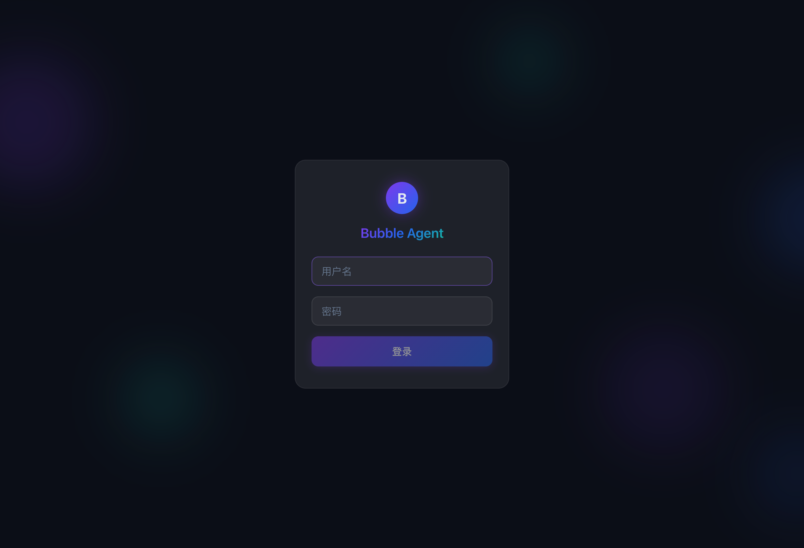
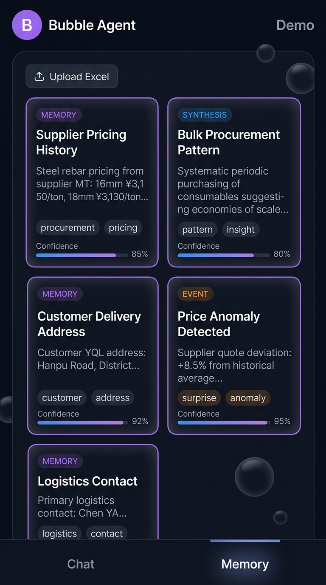

<div align="center">


# Bubble Agent OS

**An AI assistant that actually *remembers*.**

Every conversation, every imported spreadsheet, every piece of knowledge becomes a "bubble" that links, compresses, and evolves — so the AI understands you better over time.

**一个真正有记忆的 AI 助手。**

每次对话、每份导入的数据都会变成一个个"泡泡"，通过关联、压缩、演化，让 AI 越来越懂你。

[](LICENSE)
[](https://nodejs.org)
[](https://www.typescriptlang.org)
[](https://github.com/luckincoco/bubble-agent-os/stargazers)
[](https://github.com/luckincoco/bubble-agent-os/pulls)

</div>

<div align="center">

</div>

---

## Why Bubble? / 为什么是泡泡？

Most AI chatbots are goldfish — they forget everything after each conversation. RAG helps, but it's just basic vector search. **Bubble Agent OS** takes a fundamentally different approach inspired by how human memory actually works.

大多数 AI 聊天机器人都是"金鱼记忆"——每次对话后什么都忘了。RAG 有所帮助，但本质上只是向量检索。**泡泡 Agent OS** 从人类记忆的工作方式出发，采用了截然不同的方法。

> **Bubble Theory / 泡泡理论**: Every piece of information is a small bubble. Related bubbles naturally cluster together into larger bubbles. Over time, atomic facts compress into concepts, and concepts compress into user portraits — progressively approximating a true understanding of you.
>
> 每一条信息都是一个小泡泡。相关的泡泡自然聚合成更大的泡泡。随着时间推移，原子事实被压缩为概念，概念被压缩为用户画像——逐步逼近对你的真正理解。

### Bubble Agent vs Traditional RAG

| | Traditional RAG | Bubble Agent OS |
|---|---|---|
| **Retrieval** | Vector similarity only | Keyword + Vector + Graph + Recency (4-path fusion) |
| **Weights** | Fixed | Dynamic by query intent (precise / fuzzy / temporal / aggregate) |
| **Memory Decay** | None | 4-tier: Working(1h) → Active(7d) → Long-term(90d) → Archive |
| **Anomaly Detection** | None | Surprise Detector (passive, automatic) |
| **Attention** | None | Focus Tracker (sliding window over recent conversations) |
| **Abstraction** | None | 3-level Compaction: Atomic → Synthesis → Portrait |

---

## Features / 核心特性

### Three-Path Fusion Retrieval / 三路融合检索

Queries are routed through three parallel search paths, then fused with dynamic weights based on query intent:

查询通过三条并行搜索路径，根据意图动态加权融合：

- **Keyword Search** (SQLite FTS) — fast exact matching / 精确匹配
- **Vector Similarity** (cosine) — semantic understanding / 语义理解
- **Graph Traversal** (2-hop BFS) — relationship discovery / 关系发现
- **Recency Decay** (exponential) — time-aware relevance / 时间感知

```
precise  ("what's my phone number?")  →  keyword 55% | vector 25% | graph 10% | recency 10%
fuzzy    ("what have we discussed?")  →  keyword 15% | vector 45% | graph 30% | recency 10%
temporal ("what happened today?")     →  keyword 20% | vector 20% | graph 10% | recency 50%
aggregate("total procurement cost?")  →  keyword 35% | vector 30% | graph 15% | recency 20%
```

### Bubble Compaction Engine / 泡泡压缩引擎

Inspired by LeCun's [H-JEPA](https://openreview.net/forum?id=BZ5a1r-kVsf) hierarchical abstraction model. The system automatically compresses atomic memories into higher-level understanding:

受 LeCun [H-JEPA](https://openreview.net/forum?id=BZ5a1r-kVsf) 分层抽象模型启发，系统自动将原子记忆压缩为更高层次的理解：

```
Level 0 (Atomic)    →  "User bought 50 units of detergent on March 17"
                        "User bought 30 units of dish soap on March 17"
                        "User bought 100 units of tissues on March 17"
                            ↓  Union-Find clustering + LLM abstraction
Level 1 (Synthesis) →  "Periodic bulk procurement of consumables,
                         suggesting systematic purchasing planning ability"
                            ↓  Further compression
Level 2 (Portrait)  →  "Risk-aware operations manager focused on
                         cost efficiency and cash flow health"
```

- **Union-Find clustering** groups related bubbles without requiring a predefined k
- **LLM-driven abstraction leap** (not summarization) — discovers patterns, intent, and trends
- **Decay acceleration** — compressed child bubbles fade 3x faster, keeping the knowledge graph clean

### Surprise Detector / 惊讶检测器

Passively detects anomalies without explicit queries:

无需主动查询，自动检测数据异常：

- **Near-duplicate detection** — Jaccard similarity scoring
- **Contradiction detection** — flags conflicting information with existing memories
- **Numerical anomaly detection** — alerts on unusual values in imported Excel data
- Anomalies are stored as high-priority `event` bubbles that surface in future queries

### Focus Tracker / 焦点追踪

Models user attention with a sliding window over the last 10 messages:

通过最近 10 条消息的滑动窗口建模用户注意力：

- Tracks term frequency to identify current conversation focus
- Boosts retrieval scores for focus-related memories (up to +0.15)
- Fully automatic — no manual tagging required

### Semantic Bridge / 语义桥

When importing Excel data, automatically links new data to existing memories:

导入 Excel 数据时，自动将新数据关联到已有记忆：

- Identifies entity columns (suppliers, customers, products)
- Searches for matching historical bubbles
- Creates weighted `related` links in the knowledge graph

### More Features / 更多特性

- **Mobile-First PWA** — installable on mobile, dark theme with bubble animations / 移动优先 PWA，可安装到手机
- **Multi-LLM Support** — DeepSeek, OpenAI, or local Ollama / 支持多种 LLM
- **Feishu Integration** — connect via Feishu (Lark) bot for enterprise IM / 飞书机器人集成
- **Excel Analysis** — import, query, clean, cross-analyze spreadsheet data / Excel 数据分析
- **Custom Agents** — create multiple agents with different system prompts and tool sets / 自定义多 Agent
- **Scheduled Tasks** — daily digest, memory decay, keyword monitoring, bubble compaction / 定时任务调度
- **OCR** — extract text from images via Tencent Cloud OCR / 图片文字识别
- **Single-Port Deployment** — API + WebSocket + Frontend on one port / 单端口部署

---

## Architecture / 系统架构

<div align="center">

</div>



```
src/
  kernel/brain.ts         # AI reasoning engine with tool calling
  bubble/
    model.ts              # Bubble CRUD operations
    aggregator.ts         # Three-path fusion retrieval
    links.ts              # Relationship graph
  memory/
    manager.ts            # Memory orchestration
    extractor.ts          # Auto-extract memories from conversations
    compactor.ts          # Bubble Compaction Engine (Union-Find + LLM)
    surprise-detector.ts  # Passive anomaly detection
    focus-tracker.ts      # Sliding window attention tracking
    semantic-bridge.ts    # Excel ↔ Memory linking
  scheduler/              # Cron-based task scheduling
  connector/              # Tools + Feishu integration
  server/api.ts           # REST API + WebSocket
  storage/database.ts     # SQLite with migrations
web/
  src/                    # React + Vite PWA frontend
```

---

## Quick Start / 快速开始

### Prerequisites / 前置要求

- Node.js >= 20
- pnpm

### Installation / 安装

```bash
git clone https://github.com/luckincoco/bubble-agent-os.git
cd bubble-agent-os
pnpm install
```

### Configuration / 配置

```bash
cp .env.example .env
```

Edit `.env` with your LLM API key / 编辑 `.env` 填入你的 API Key：

```env
# DeepSeek (recommended / 推荐)
DEEPSEEK_API_KEY=sk-your-key-here

# Or OpenAI
# OPENAI_API_KEY=sk-your-key-here
# LLM_PROVIDER=openai

# Or local Ollama (fully offline / 完全离线)
# LLM_PROVIDER=ollama
```

### Build & Run / 构建运行

```bash
# Build everything
pnpm build:all

# Start with web UI
pnpm start --serve
```

Open http://localhost:3000 in your browser. Default login: `bobi` / `bubble123`

打开 http://localhost:3000，默认账号：`bobi` / `bubble123`

### Development / 开发

```bash
pnpm dev          # Dev mode with hot reload
pnpm build:web    # Build frontend only
pnpm lint         # Type check
pnpm test         # Run tests
```

---

## Supported LLM Providers / 支持的 LLM

| Provider | Model | Setup |
|----------|-------|-------|
| DeepSeek | deepseek-chat | `DEEPSEEK_API_KEY` |
| OpenAI | gpt-4o-mini | `OPENAI_API_KEY` + `LLM_PROVIDER=openai` |
| Ollama | any local model | `LLM_PROVIDER=ollama` (fully offline) |

---

## Screenshots / 界面截图

<table>
<tr>
<td width="50%">

**Login / 登录页**



</td>
<td width="50%">

**Memory Panel / 记忆面板**



</td>
</tr>
</table>

---

## Roadmap

- [ ] Docker one-line deployment / Docker 一键部署
- [ ] Plugin system for custom tools / 插件系统
- [ ] Multi-user collaboration / 多人协作增强
- [ ] Web search result → Bubble auto-import / 网页搜索结果自动导入
- [ ] Voice input + TTS output / 语音输入输出
- [ ] Dashboard for memory analytics / 记忆分析仪表盘

---

## Contributing / 贡献

Contributions are welcome! Feel free to open issues or submit pull requests.

欢迎贡献！请随时提 Issue 或提交 Pull Request。

```bash
# Fork, clone, then:
pnpm install
pnpm dev
# Make your changes, then:
pnpm lint && pnpm test
```

---

## License

[MIT](LICENSE) - Use it, fork it, build on it.

---

<div align="center">

**If Bubble Agent OS helps you, give it a star!**

**如果泡泡 Agent 对你有帮助，请给个 Star！**

[](https://star-history.com/#luckincoco/bubble-agent-os&Date)

</div>
